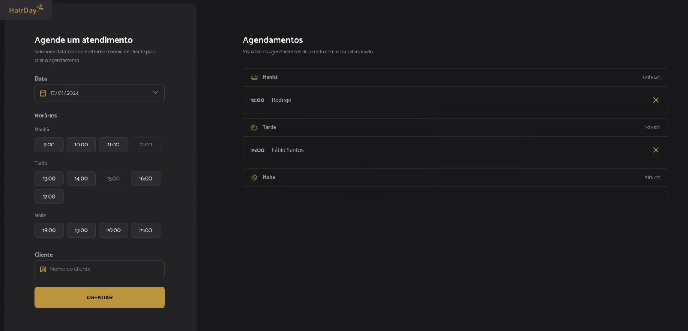

# Hair Day - Appointment Scheduler



This project is a web application for scheduling haircut appointments, developed as part of a full-stack development study. It features a clean interface for creating, viewing, and canceling appointments.

## ✨ Features

- **Schedule Appointments**: Users can select a date, choose an available time slot, and enter a client's name to book an appointment.
- **View Daily Schedules**: The application displays all appointments for the selected day, neatly organized into "Morning", "Afternoon", and "Night" periods.
- **Cancel Appointments**: Scheduled appointments can be easily canceled directly from the schedule view.
- **Dynamic Time Slots**: The system automatically disables past time slots and already booked hours, ensuring no scheduling conflicts.
- **Mock Backend**: Uses `json-server` to simulate a REST API for managing appointment data.

## 🛠️ Technologies Used

- **Frontend**: HTML5, CSS3, JavaScript (ES6+)
- **JavaScript Library**: [Day.js](https://day.js.org/) for date and time manipulation.
- **Module Bundler**: [Webpack](https://webpack.js.org/)
- **Mock API**: [json-server](https://github.com/typicode/json-server)
- **Development Server**: [webpack-dev-server](https://webpack.js.org/configuration/dev-server/)

## 🚀 Getting Started

To run this project locally, follow these steps:

1.  **Clone the repository:**

    ```sh
    git clone <repository-url>
    cd hairday
    ```

2.  **Install dependencies:**

    ```sh
    npm install
    ```

3.  **Run the mock API server:**
    This will start a server on `http://localhost:3333` using the [server.json](server.json) file as a database.

    ```sh
    npm run server
    ```

4.  **Run the development server:**
    In a new terminal, run the following command. This will start the application with live reload on `http://localhost:3000`.

    ```sh
    npm run dev
    ```

5.  Open your browser and navigate to `http://localhost:3000`.

## 📂 Project Structure

The main source code is located in the `src/` directory:

```
src/
├── assets/         # SVG icons and images
├── libs/           # Configuration for third-party libraries like dayjs
├── modules/        # JavaScript modules for different parts of the application (form, schedules)
├── services/       # Modules for API communication (fetching, creating, canceling)
├── styles/         # CSS stylesheets
├── utils/          #
```

## 📄 License

This project is for educational and demonstration purposes.

---

<p align="center">Made with ❤️ by <a href="https://www.linkedin.com/in/gustavo-santos-744549234/">Gustavo Arruda</a></p>
